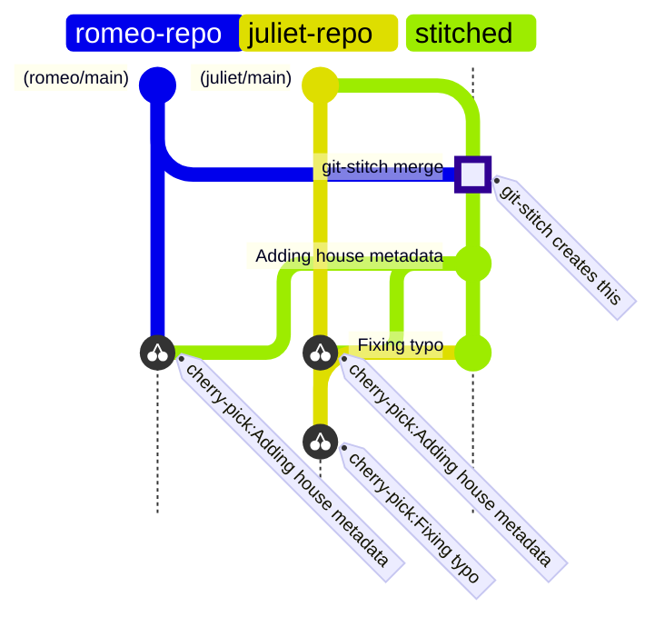

# git-stitch & git-rip: tools for mono-repo'ing your multi-repo.

`git-stitch` combines two repos into one repo, so you (or a coding
agent or a code search tool) can operate on them as one. `git-rip`
takes any commits done on this combined repo, and splits
them up into commits that can be applied to the base repos.

## WARNING ⚠️

This tool abuses some `git` features and functionalities and assumes
some familiarity with fancy `git` footwork.
Be careful!

Also, definitely vibe coded.

## Usage Example

In this example, Romeo and Juliet are our two repos, alike in dignity.

```
$ export GIT_AUTHOR_NAME="Test User"
$ export GIT_AUTHOR_EMAIL="test@example.com"
$ export GIT_COMMITTER_NAME="Test User"
$ export GIT_COMMITTER_EMAIL="test@example.com"
$ git init
$ git remote add romeo https://github.com/philz/romeo.git
$ git remote add juliet https://github.com/philz/juliet.git
$ git-stitch romeo/main juliet/main
Fetching romeo... romeo/main is a88073f262f07f76e367b6f2f7df2b0be13c6494
Fetching juliet... juliet/main is 40840a7aa72be6ce82659a78d566d8598a845760
Stitched juliet & romeo into 39202c39c656d36ae47157766ef147328339abbf
To check out the new commit, run:
  git checkout -b mono 39202c39c656d36ae47157766ef147328339abbf
Or to update your current branch:
  git reset 39202c39c656d36ae47157766ef147328339abbf
$ echo "Caplet" >> juliet/house.txt
$ echo "Romeo" >> romeo/house.txt
$ git add juliet/house.txt romeo/house.txt
$ GIT_AUTHOR_DATE="2024-01-01T00:00:00Z" GIT_COMMITTER_DATE="2024-01-01T00:00:00Z" git commit -m'Adding house metadata.'
[mono fa6e575] Adding house metadata.
$ echo "Capulet" > juliet/house.txt
$ GIT_AUTHOR_DATE="2024-01-01T00:01:00Z" GIT_COMMITTER_DATE="2024-01-01T00:01:00Z" git commit -a -m'Fixing typo'
[mono ab98164] Fixing typo
$ git-rip verona
Found base commit: 39202c39c656d36ae47157766ef147328339abbf
Processing commit: fa6e575d7268a98dae107e050edbef088787e014
Created commit 575b240b0efcbb8eb1d534cedeac4347839ea598 for juliet
Created commit fca4f2d9e9bb9688f4c0178e0d401e03f87d5629 for romeo
Processing commit: ab98164bf941ce213cd55022581a7501a3a16d27
Created commit c8891f4f37d7953e28d671b5f4ed5f467465c5a6 for juliet
Branches created:
  verona-juliet
  verona-romeo
```

## Installation

```
go install github.com/philz/git-stitch/cmd/git-stitch github.com/philz/git-stitch/cmd/git-rip
```

## Usage

```
git-stitch [-no-fetch] ref1 [ref2...]

Creates a new commit which includes the tree of ref1 in a directory named
as the first component of ref1 when split by /, and the same for any additional
refs. Typically, refs might look like "remote/branch".

To help with determinism, the merge commit uses the same timestamps when
given the same refs (and they point to the same commits). The git author is
"git-stitch"
```

```
git-rip [prefix]
```

Splits any commits since the original merge into branches prefixed with prefix
and suffixed by the directory name. If no prefix is specified, "rip-<timestamp>" is used.

## Use cases

Tell me about yours. Mine are:

1. "git grep" across several repos.

2. Giving a single repo to a coding agent, which then needs to work across those repos to make some changes.

## How does this work?

See https://blog.philz.dev/blog/git-monorepo/

## What does this look like visually?

Mermaid doesn't like having merges between unrelated trees,
but this is a fair representation.



If you prefer, here's the relevant equivalent with `git log`, slightly edited for clarity.

```
$git log --graph --decorate --oneline HEAD rip-juliet rip-romeo 
* b84f989 (HEAD) fixing typo
* 189c64e Adding house metadata.
*   b46a39a git-stitch merge
|\
| | * 6f15d97 (rip-juliet) fixing typo [cherry pick]
| | * 31ace14 Adding house metadata. [cherry pick]
| |/
|/|
* | 40840a7 (juliet/main) Initial commit
 /
| * 9ead60d (rip-romeo) Adding house metadata. [cherry pick]
|/
* a88073f (romeo/main) Initial commit
```

## How was this built?

I used the PROMPT.txt in this repo to build the tool with [Sketch](https://sketch.dev).
It took a few iterations of prompting, especially in fixing the `git-rip` command.
